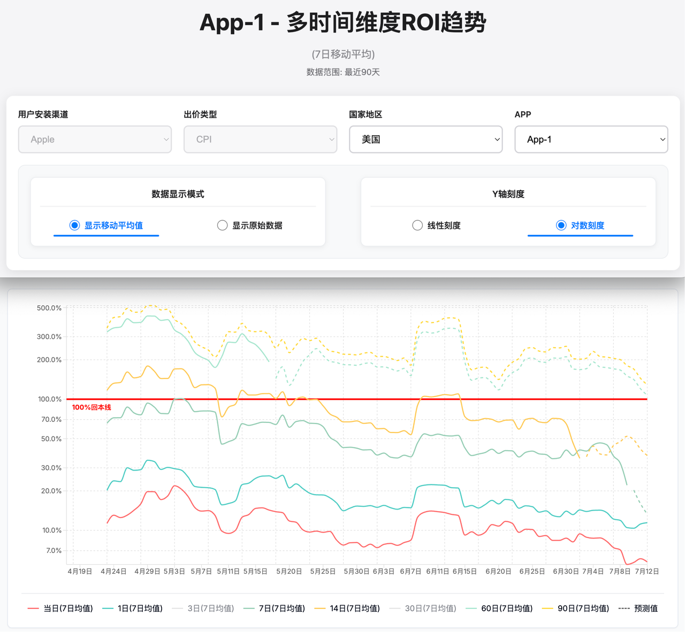

# 广告 ROI 数据分析系统 - 面试题目

> 基于真实移动应用广告投放数据的 Web 开发与数据可视化考察题目

## 一、项目背景

考察候选人的 Web 开发能力和数据可视化能力。

---

## 二、数据说明

### 2.1 数据文件

- `app_roi_data.csv`：主要数据文件

### 2.2 数据结构

| 列名 | 说明 | 示例 |
|------|------|------|
| 日期 | 投放日期 | 2025-04-13(日) |
| app | 应用名称 | App-1 ~ App-5 |
| 出价类型 | 广告出价类型 | CPI |
| 国家地区 | 投放国家 | 美国、英国 |
| 应用安装.总次数 | 当日应用安装次数 | 140 |
| 当日ROI | 当日投资回报率 | 6.79% |
| 1日ROI | 1日累计ROI | 14.24% |
| 3日ROI | 3日累计ROI | 27.3% |
| 7日ROI | 7日累计ROI | 64.44% |
| 14日ROI | 14日累计ROI | 120.89% |
| 30日ROI | 30日累计ROI | 214.65% |
| 60日ROI | 60日累计ROI | 368.42% |
| 90日ROI | 90日累计ROI | 413.81% |

### 2.3 数据特点

- **时间范围**：2025-04-13 ~ 2025-07-12（3 个月）
- **总记录数**：910 条
- **应用数量**：5 个（App-1 ~ App-5）
- **投放国家**：美国、英国
- **出价类型**：CPI（每次安装成本）

### 2.4 0% 数据处理说明

**两种含义：**

1. **真实 0%**：该日期实际 ROI 为 0%（无收益或亏损）
2. **日期不足 0%**：距离数据截止日期不足对应 ROI 统计周期

**日期不足规则：**

| 条件 | 显示 |
|------|------|
| 距截止 < 90 天 | 90日ROI 为 0% |
| 距截止 < 60 天 | 60日ROI 为 0% |
| 距截止 < 30 天 | 30日ROI 为 0% |
| 以此类推... | ... |

**处理建议：**

- 数据库增加标识字段区分两种 0%
- 图表中可隐藏「日期不足」数据点，或用不同样式
- 悬停提示中说明 0% 具体原因

### 2.5 数据存储要求

- **必须**：CSV 导入数据库后，通过数据库查询展示
- **禁止**：直接读取 CSV 进行查询和展示
- **要求**：合理表结构设计、实现 CSV 批量导入

---

## 三、页面设计规范

### 3.1 整体布局

- **页面标题**：`App-X - 多时间维度ROI趋势`（X 为选中的应用编号）
- **副标题**：`(7日移动平均)`
- **数据范围**：`数据范围: 最近90天`

### 3.2 筛选控制区域

**第一行（从左到右）：**

- 用户安装渠道（下拉，如 Apple）
- 出价类型（下拉，如 CPI）
- 国家地区（下拉，美国、英国等）
- APP（下拉，App-1 ~ App-5）

**第二行（单选框，水平排列）：**

- 数据显示模式：○ 显示移动平均值  ○ 显示原始数据
- Y轴刻度：○ 线性刻度  ○ 对数刻度

### 3.3 图表区域

- **类型**：多曲线趋势图
- **数据线（8 条）**：当日、1日、3日、7日、14日、30日、60日、90日（均为 7 日均值）
- **预测数据**：虚线，颜色与对应数据线一致
- **100% 回本线**：红色水平线，标注「100%回本线」
- **坐标轴**：X 轴为日期，Y 轴为百分比
- **图例**：展示各数据线颜色与名称

### 3.4 交互功能

- 筛选器切换时，图表与标题同步更新
- 单选框切换时，显示模式（移动平均/原始、线性/对数）更新
- 鼠标悬停显示具体数值
- 图例点击切换对应数据线显示/隐藏

---

## 四、题目要求

### 4.1 基础要求（必须完成）

#### 1. 数据库设计与数据导入

- 设计 ROI 数据表结构
- 区分并标识「真实 0%」与「日期不足 0%」
- 实现 CSV 批量导入

#### 2. 数据读取与展示

- 通过数据库查询获取数据（禁止直接读 CSV）
- 支持应用、国家、日期范围等筛选
- 设计合理 API 接口

#### 3. ROI 趋势图表

- 多时间维度趋势线：当日、1/3/7/14/30/60/90 日
- 支持按应用、国家筛选
- 图例清晰，包含 100% 回本线（红色水平线）
- 支持预测数据（虚线）
- X 轴为时间，Y 轴为百分比
- 正确处理两种 0% 情况

#### 4. 页面布局与交互

- 实现规范中的布局和样式
- 顶部筛选器：用户安装渠道、出价类型、国家地区、APP
- 数据显示模式与 Y 轴刻度的单选框

#### 5. 文档（基础要求）

| 文档 | 内容 |
|------|------|
| 系统设计文档 | 整体架构、表结构、API 规范、前端组件架构 |
| 使用说明 | 安装运行、数据导入、图表操作、筛选与控制说明 |
| 部署文档 | 环境要求、数据库初始化、项目配置、部署流程 |

### 4.2 进阶要求（加分项）

- **图表**：对数/线性切换、移动平均切换、悬停详情、图例显隐
- **分析**：ROI 预测、移动平均、0% 数据智能处理
- **体验**：响应式、暗色模式
- **架构**：前后端分离、API 规范、结构清晰、错误处理完善

---

## 五、技术栈建议

### 5.1 推荐方案

| 层级 | 技术 |
|------|------|
| 前端 | Next.js 14 + React 18 + TypeScript + Tailwind CSS + ShadCN/UI + Recharts |
| 后端 | Node.js + Express.js + TypeScript（必需） |
| 数据库 | MySQL 8.0+ 或 PostgreSQL 13+ |
| 渲染 | CSR（客户端渲染） |

### 5.2 替代方案

- **前端**：Vue 3、Angular 15+；图表：D3.js、ECharts
- **后端**：Python (Flask/Django)、Java (Spring Boot)、Go (Gin)
- **数据库**：PostgreSQL、MySQL、SQLite（开发）

### 5.3 开发环境

- Node.js 18+
- MySQL 8.0+ 或 PostgreSQL 13+
- npm / yarn

---

## 六、评分标准

| 维度 | 权重 | 要点 |
|------|------|------|
| 功能实现 | 40% | 数据展示 20%、图表 15%、界面交互 5% |
| 文档质量 | 25% | 设计文档 10%、使用说明 8%、部署文档 7% |
| 代码质量 | 20% | 结构、命名、错误处理、规范 |
| 用户体验 | 10% | 美观、流畅、响应式、易用 |
| 技术深度 | 5% | 选型、性能、扩展性 |

---

## 七、提交要求

1. **代码**：完整项目（GitHub 地址）
2. **演示**：部署地址
3. **文档**：README.md、DESIGN.md、USER_GUIDE.md、DEPLOYMENT.md
4. **可选**：AI 提示词导出、演示视频

### 文档内容要求

**DESIGN.md**：架构图、数据库 ER 图、API 规范、前端组件结构、数据流图

**USER_GUIDE.md**：功能说明、数据导入、图表操作、筛选与控制、界面截图

**DEPLOYMENT.md**：环境依赖、数据库配置、安装与初始化、启动方式、生产配置

---

## 八、预估工时

| 阶段 | 时间 |
|------|------|
| 数据库设计与导入 | 1–2h |
| API 开发 | 1–2h |
| 前端数据展示 | 1–2h |
| 图表功能 | 2–3h |
| 布局与交互 | 1–2h |
| 文档编写 | 1–2h |
| 进阶功能 | 1–2h |
| 优化完善 | 1h |

**总计**：约 9–16 小时

---

## 九、注意事项

1. **必须**使用数据库存储数据，禁止直接读取 CSV
2. 考察全栈能力：库表设计、API、前端可视化
3. 图表为核心，需实现多维度 ROI 趋势线及 100% 回本线
4. 数据导入为必做功能
5. 代码质量与用户体验均计入评分
6. 可使用任意开源库与框架
7. 鼓励创新与个性化实现
8. 文档为必做要求，不可省略

---

*如有疑问，请联系面试官。祝面试顺利。*
